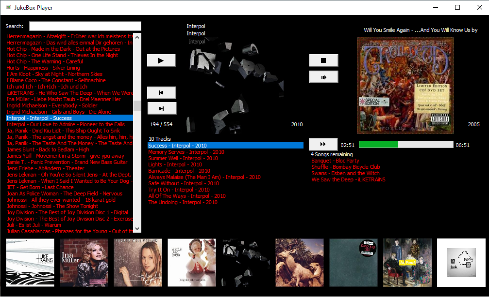
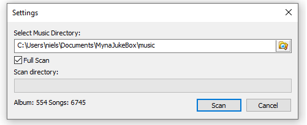
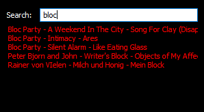
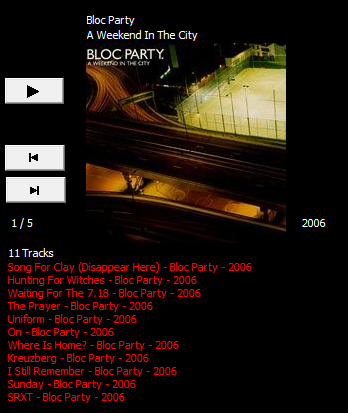
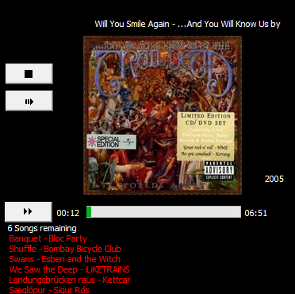
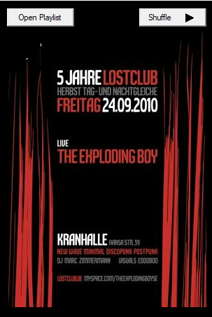

# MynaJukeBox

## Overview

A jukebox player to play MP3 files for windows. The project is from 2011 but it is still working. Now VS 2019 is required to build the solution.

## Installation

Microsoft Visual C++ Redistributables have to be installed (VC_redist.x86.exe).
See: https://support.microsoft.com/en-us/help/2977003/the-latest-supported-visual-c-downloads.

The latest MSI file can be found here: https://github.com/nylssoft/MynaJukeBox/releases/download/v1.0.0.1/MynaJukeBox.msi.

## Music Directory and File Structure

The following section shows the directory and file structure for the music directory that is scanned
by the jukebox player. A full scan will read all metadata from the MP3 files in this directory structure.
The result of the full scan can be found in %localappdata%\NylsSoft\JukeBoxPlayer.
If full scan is not used the metadata of the MP3 files is read from the CSV files in this directory.

The MP3 files should be organized in the following directory structure:

* Interpret 1
  * Album 1
    * Track 1.mp3
    * *Further tracks*
    * Folder.jpg
  * Album 2
    * Track 1.mp3
    * *Further tracks*
    * Folder.jpg
  * *Further Albums*
 * *Further Interprets*

## How to Use the JukeBox Player

On the first start the settings dialog is displayed that allows you to enter the music directory.
For further starts the settings dialog can be opened again using the menu "Settings..." in the upper left corner of the application window.

The window has four parts:

* The left part shows the list of all albums. The list can be filtered using the search text field.

* The middle part shows the album that is selected in the album list. It shows the cover, the number of the current album of all albums, the album date, the number of tracks and the tracks itself. The Play button clears the current playlist and adds all tracks of the album to the playlist. The Next and Previous buttons move to the next or previous album. Double click on a track to move the track to the playlist.

.

* The right part shows the playlist. The Stop button stops playing and clears the playlist. The Pause button pauses playing. The Forward button moves forward to the next track in the playlist.

If no playlist exists a Shuffle button is displayed to create a playlist with 100 random tracks. The Open Playlist button opens a recently created playlist in an editor (from the application directory) and fills the playlist with these tracks.

* The bottom part shows 10 covers with the cover of the selected album in the middle. You can click on a cover to move forward or backward in the album list.

## Build

- Build with VS 2019
- WiX ToolSet is required to build a MSI, see https://http://wixtoolset.org/

## Licenses

### taglib

Source code from the **taglib** project is used in this jukebox player.
The source code has not been updated, it is from 2011. See https://github.com/taglib/taglib
for current status of the **taglib** project.

### Open Icon Library

The following icons are used from the Open Icon Library (https://sourceforge.net/projects/openiconlibrary):

tuxguitar.png / wiki_commons_cc / MIT
