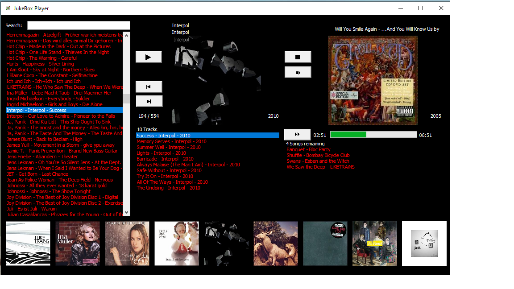
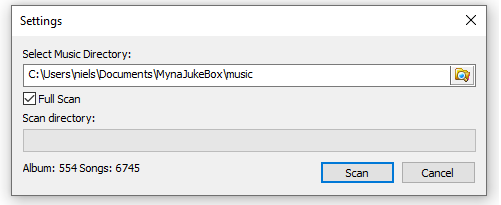

# MynaJukeBox

## Overview

A jukebox player to play MP3 files for windows. The project is from 2011 but it is still working. Now VS 2019 is required to build the solution.

## Installation

Microsoft Visual C++ Redistributables have to be installed (VC_redist.x86.exe).
See: https://support.microsoft.com/en-us/help/2977003/the-latest-supported-visual-c-downloads.

The latest MSI file can be found here: .

## Music Directory and File Structure

The following section shows the directory and file structure for the music directory that is scanned
by the jukebox player. A full scan will read all metadata from the MP3 files in this directory structure.
The result of the full scan can be found in %localappdata%\NylsSoft\JukeBoxPlayer.
If full scan is not used (the default after the first full scan) the metadata of the MP3 files is read from the CSV files in this directory.

The MP3 files should be organized in the following directory structure:

* Interpret 1
  * Album 1
    * Track 1.mp3
    * *Further tracks*
    * Folder.jpg
  * Album 2
    * Track 1.mp3
    * *Further tracks*
    * Folder.jpg
  * *Further Albums*
 * *Further Interprets*

## How to use the jukebox player

On the first start the settings dialog is displayed that allows to enter the music directory.
For further starts the stettings dialog can be opened again using the menu "Settings..." in the open left corner of the application window.

## Licenses

### taglib

Source code from the **taglib** project is used in this jukebox player.
The source code has not been updated, it is from 2011. See https://github.com/taglib/taglib
for current status of the **taglib** project.

### Open Icon Library

The following icons are used from the Open Icon Library (https://sourceforge.net/projects/openiconlibrary):

tuxguitar.png / wiki_commons_cc / MIT
